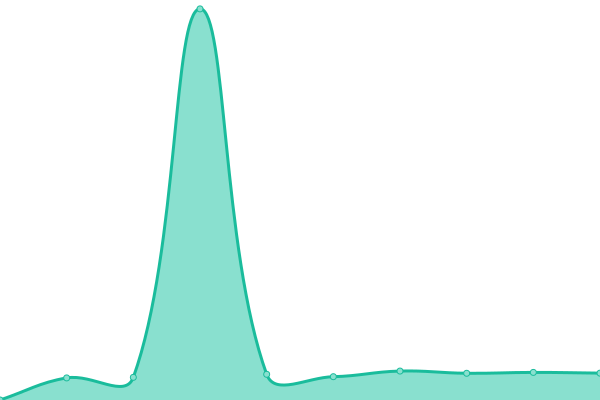
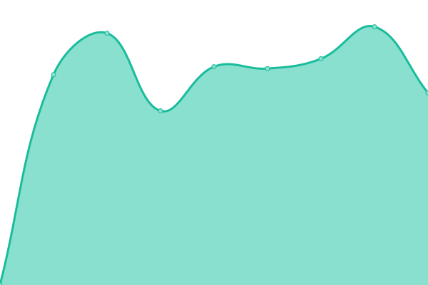

# [📈 Live Status](https://ayalon.github.io/upptime): <!--live status--> **🟩 All systems operational**

This repository contains an uptime monitor and status page.

<!--start: status pages-->
<!-- This summary is generated by Upptime (https://github.com/upptime/upptime) -->
<!-- Do not edit this manually, your changes will be overwritten -->
<!-- prettier-ignore -->
| URL | Status | History | Response Time | Uptime |
| --- | ------ | ------- | ------------- | ------ |
|  [famillesuisse.ch](https://famillesuisse.ch) | 🟩 Up | [famillesuisse-ch.yml](https://github.com/ayalon/upptime/commits/HEAD/history/famillesuisse-ch.yml) | 

 1077ms
     
 | 

<a href="https://ayalon.github.io/upptime/history/famillesuisse-ch">99.60%</a>
    

|  [shop.famillesuisse.ch](https://shop.famillesuisse.ch) | 🟩 Up | [shop-famillesuisse-ch.yml](https://github.com/ayalon/upptime/commits/HEAD/history/shop-famillesuisse-ch.yml) | 

 945ms
     
 | 

<a href="https://ayalon.github.io/upptime/history/shop-famillesuisse-ch">99.61%</a>
    

|  [lessmess.io](https://lessmess.io) | 🟩 Up | [lessmess-io.yml](https://github.com/ayalon/upptime/commits/HEAD/history/lessmess-io.yml) | 

 1893ms
     
 | 

<a href="https://ayalon.github.io/upptime/history/lessmess-io">99.61%</a>
    

|  [creced.ch](https://creced.ch) | 🟩 Up | [creced-ch.yml](https://github.com/ayalon/upptime/commits/HEAD/history/creced-ch.yml) | 

 1406ms
     
 | 

<a href="https://ayalon.github.io/upptime/history/creced-ch">100.00%</a>
    

|  [ayalon.ch](https://ayalon.ch) | 🟩 Up | [ayalon-ch.yml](https://github.com/ayalon/upptime/commits/HEAD/history/ayalon-ch.yml) | 

 541ms
     
 | 

<a href="https://ayalon.github.io/upptime/history/ayalon-ch">99.77%</a>
    

|  [xtramarketing.ch](https://xtramarketing.ch) | 🟩 Up | [xtramarketing-ch.yml](https://github.com/ayalon/upptime/commits/HEAD/history/xtramarketing-ch.yml) | 

 972ms
     
 | 

<a href="https://ayalon.github.io/upptime/history/xtramarketing-ch">99.62%</a>
    

|  [jira.ayalon.ch](https://jira.ayalon.ch) | 🟩 Up | [jira-ayalon-ch.yml](https://github.com/ayalon/upptime/commits/HEAD/history/jira-ayalon-ch.yml) | 

 575ms
     
 | 

<a href="https://ayalon.github.io/upptime/history/jira-ayalon-ch">98.30%</a>
    

<!--end: status pages-->

[**Visit our status website →**](https://ayalon.github.io/upptime)
